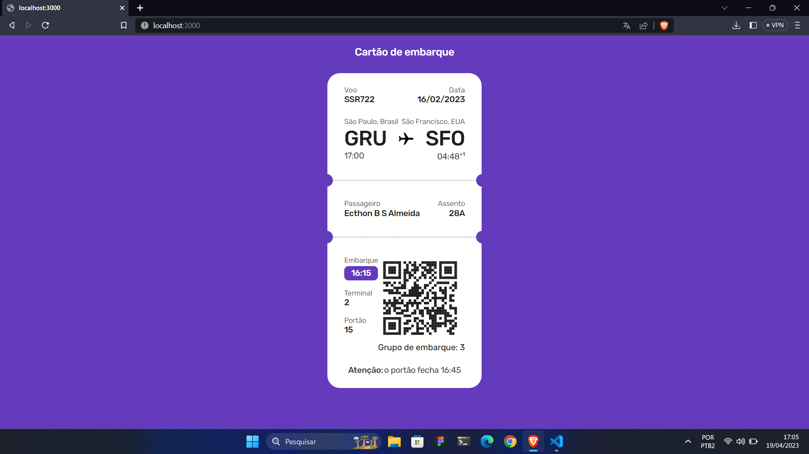

<h1 align="center">#boraCodar-06 - Ticket de embarque.</h1> 

<h1 align="center">
  
</h1>

## ✨ Tecnologias

Esse projeto foi desenvolvido com as seguintes tecnologias:

- [Next.js](#✨-tecnologias)
- [Sass](#✨-tecnologias)

## 💻 Projeto

Desafio #boraCodar de número 15. Desenvolva um componente pricing table. 

## 🔖 Layout

Você pode visualizar o layout do projeto através [desse link](https://www.figma.com/community/file/1205146101173113980/%23boraCodar---Desafio-6). É necessário ter conta no [Figma](http://figma.com/) para acessá-lo.

## 📄 Licença

Esse projeto está sob a licença MIT. Veja o arquivo [LICENSE](LICENSE.md) para mais detalhes.

---

Feito com ♥ by Ecthon 👋🏻.